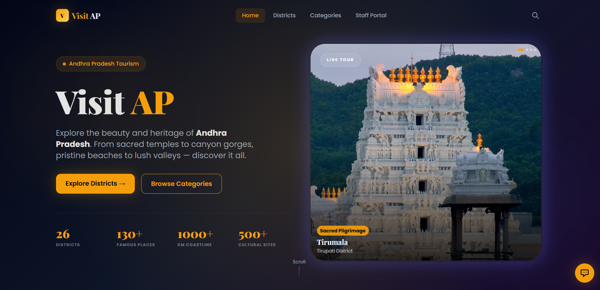

# 🌍 Visit AP — Geo-Enabled Tourism Platform



> Discover the beauty, culture, and heritage of Andhra Pradesh through a modern, geolocation-powered tourism platform.

---

## 🗺️ Project Overview

**Visit AP** is a full-stack MERN application designed to help users explore tourist destinations across Andhra Pradesh in an intuitive and visually engaging way.

The platform enables users to:
- Explore districts and famous places
- Discover attractions based on categories
- Navigate using real-time geolocation
- Find nearby tourist spots using geospatial queries

---

## ✨ Key Features

### 📍 Geolocation-Based Navigation
- Detects user's current location using browser API
- Calculates distance to selected destination
- Redirects to Google Maps for live navigation

---

### 🧭 Nearby Places Recommendation
- Uses MongoDB geospatial queries (`2dsphere`)
- Shows attractions within:
  - 5 km
  - 10 km
  - 20 km radius

---

### 🏞️ District & Category Exploration
- Browse Andhra Pradesh district-wise
- Explore places based on categories:
  - Temples
  - Beaches
  - Hill Stations
  - Historical Sites
  - Nature & Wildlife

---

### 🔐 Admin Portal
- JWT-based authentication
- Full CRUD operations:
  - Add / Edit / Delete districts
  - Add / Edit / Delete places
- Image management via Cloudinary

---

### 🔎 Smart Search
- Debounced search (300ms)
- Search across districts and places
- Quick navigation to results

---

## 🛠️ Tech Stack

| Layer | Technology |
|------|-----------|
| Frontend | React 18 + Vite, Tailwind CSS, Framer Motion |
| Backend | Node.js, Express.js (MVC Architecture) |
| Database | MongoDB Atlas + Mongoose |
| Geospatial | MongoDB `2dsphere` index |
| Maps | Leaflet + OpenStreetMap |
| Authentication | JWT + bcrypt |
| Image Storage | Cloudinary |
| Deployment | Vercel (Frontend), Render (Backend) |

---

## 🚀 Getting Started

### 1️⃣ Clone Repository

```bash
git clone <your-repo>
cd visitap